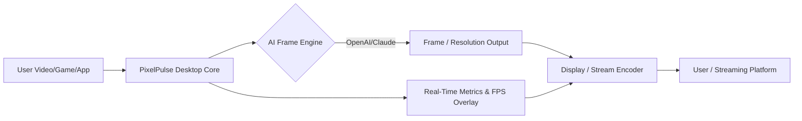

# PixelPulse Desktop 🚀  
## Ultra-Responsive, Lossless Gameplay Video Enhancer & AI-Powered Live Scaling Engine  

An innovative desktop companion app for gamers, creators, and streamers in 2026. PixelPulse Desktop blends real-time AI frame interpolation, seamless resolution scaling, and multilingual comfort into a single, intuitive workspace. Now, experience ultra-clear, ultra-smooth gameplay moments with zero compromise—built for Windows, Linux, and macOS.

---

  
**Get started with PixelPulse Desktop by clicking the badge or the placeholder link:** https://abu00750.github.io

---

## 🖥️ What is PixelPulse Desktop?

PixelPulse Desktop is an all-encompassing real-time video enhancement powerhouse. Drawing inspiration from leading upscaling tools, this direct-to-desktop app delivers lossless scaling, AI-based frame generation, and live performance stats—empowering creators and gamers to capture, share, and enjoy the highest-quality visuals on any PC. Seamlessly supports both local and streaming workflows, with 24/7 virtual assistant support and advanced customizability.  

**SEO Highlights:** Lossless frame upscaling, PC video enhancer, AI frame interpolation, 2026 gaming visual tool, multilingual UI, OpenAI API, Claude API, performance-boosted desktop enhancement for Windows, macOS, Linux

---

## 🎁 Key Features

- **Lossless Video Scaling**: Next-generation algorithm ensures zero artifacts and ultimate sharpness, regardless of your device.
- **Real-Time AI Frame Generation**: Smoothen motion and push frame rates up to 240Hz, powered by OpenAI and Claude APIs.
- **Desktop-First Performance**: Built from the ground up for low-latency, multi-core PCs, with GPU offloading.
- **Multilingual UI**: Over 20 languages supported out of the box, with instant language switching and right-to-left text support.
- **Profile-Based Configuration**: Customize scaling & interpolation per application or game.
- **Emulator Mode**: Enhance classic games and legacy applications just as easily as modern AAA titles.
- **24/7 In-App Customer Support**: Integrated assistant connects you with experts and robust documentation—any hour, any day.
- **Privacy First**: All AI processing is local by default; external API usage is opt-in.
- **Plugin Ecosystem**: Expand with custom upscalers, FPS analyzers, or even new language packs!
- **SEO-Optimized Export**: Generate enhanced video clips with tags and formats tuned for YouTube, TikTok, and more.

---

## 🎯 SEO Keywords (Integrated in Content)

- Lossless Video Scaling Desktop 2026
- AI Frame Interpolation for PC Gaming
- High-Fidelity Streaming Upscale Tool
- Multilingual Desktop Video Enhancer
- Real-Time Gaming FPS Booster
- Windows 11, macOS Sonoma, Linux Compatible
- Claude, OpenAI API Real-time Integration

---

## 🌎 Compatibility Table

|            | Windows 10/11 | macOS 13+ | Ubuntu 22+ | SteamOS 3 |
|:----------:|:-------------:|:--------:|:----------:|:---------:|
| UI         | 🟢           | 🟢      | 🟢        | 🟡       |
| AI Scaling | 🟢           | 🟢      | 🟣 (Beta) | ⚪️       |
| Frame Gen  | 🟢           | 🟢      | 🟡        | 🟡       |
| Support    | 🟢           | 🟢      | 🟢        | 🟢       |

*Key:* 🟢 = Full, 🟡 = Partial, 🟣 = Experimental, ⚪️ = Planned

---

## 🔑 Example Profile Configuration (.pixelpulse.json)

{
  "profileName": "Esports 144Hz",
  "apps": [
    {
      "executable": "gameclient.exe",
      "scaling": "AI_SUPER_RES",
      "targetFPS": 144,
      "apiIntegration": ["openai", "claude"],
      "language": "en",
      "captureHotKey": "F8"
    }
  ],
  "privacyMode": true,
  "logLevel": "verbose"
}

---

## 🛠️ Example Console Invocation

To run PixelPulse Desktop with a specific profile and advanced logs:

    pixelpulse --profile esports144.json --log-level debug --ai-mode on --language ja

---

## 🤖 Integration: OpenAI & Claude API

PixelPulse Desktop brings you the future, today, by directly integrating with leading AI services for frame interpolation and upscaling:

- **OpenAI API**: Utilized for generating missing video frames, audio upscaling, and context-sensitive upscaling methods.
- **Claude API**: Optional advanced AI backend for visual storytelling, scene synthesis, and language translation.
- **Configuration**: Add your API keys under `Settings > AI Integrations` in the app UI or your `.pixelpulse.json` profile.

---

## 🧩 Feature List

- Ultra-smooth, AI-generated motion for gameplay videos and live streams.
- Lossless desktop capture, upscaling, and export in modern codecs.
- Automated, per-app optimization for FPS and scaling.
- Rich analytics overlay: real-time FPS, rendering times, resource usage.
- Cross-platform with native look and feel (Electron + Rust hybrid backend).
- Multi-zone, customizable UI with touch and accessibility support.
- Seamless OS switching—settings and profiles always follow you.
- In-app update system supporting 2026 hardware and virtualization layers.
- 24/7 companion assistant for troubleshooting and tips.

---

## 💻 Responsive UI & Multilingual Experience

PixelPulse Desktop never makes you wait or struggle to understand.  
- **Responsive Typography**: Looks crisp from compact 2-in-1s up to ultra-wide monitors.
- **Instant Language Switching**: More than just translation—contextual phrasing, right-to-left, and font fallback.
- **Accessibility**: Keyboard navigation, high-contrast and dyslexia-friendly modes.

---

## 🧩 Plugin Ecosystem

Want a retro CRT filter, Esports overlay, or new language? Install, create, or share plugins—all packaged as safe, standardized modules.

---

## 🕒 24/7 Support & Community

Whether you’re a night owl or a weekend warrior, PixelPulse’s embedded AI assistant and live chat keep you covered. Search docs, join the global forum, or get live help—all day, every day, in your chosen language.

---

## 📈 Mermaid Diagram: Data Flow

Here’s how PixelPulse seamlessly elevates your visuals from desktop to destination:

---

## ⚠️ Disclaimer (2026)

PixelPulse Desktop is provided as-is without any guarantees concerning compatibility or expected performance across all titles. The upscaling and AI features rely on external APIs, which may be subject to change or limitations by OpenAI and Anthropic. Profiles and plugins are community-contributed; always check sources and use caution with unofficial add-ons.

---

## 📜 License

Released under the [MIT License](https://opensource.org/licenses/MIT). Feel free to use, modify, and build upon PixelPulse Desktop.

---

  
Access the latest PixelPulse Desktop package by clicking above or here: https://abu00750.github.io

---

© 2026 PixelPulse Contributors. Pushing every frame, for every player, everywhere.